# 🎊 FuAI（福联 AI）

<div align="center">


**融合传统文化与 Web3 技术的 AI 春联 NFT 创作平台**

[](https://nextjs.org/)
[](https://soliditylang.org/)
[](https://www.langchain.com/)
[](https://monad.xyz/)

</div>

---

## 📖 项目简介

**FuAI** 是一个创新性的 Web3 + AI 项目，将中国传统春联文化与现代区块链技术完美结合。用户可以：

- 🤖 **AI 智能创作**：通过 LangChain 驱动的 AI 生成个性化春联
- 🎨 **多风格定制**：支持 8 种祝福主题 × 4 种预期氛围 × 4 种创作风格的春联生成，8种画风图片生成
- 💎 **NFT 铸造**：将创作的春联永久保存在区块链上
- 🖼️ **作品展示**：精美的 NFT 画廊，支持点赞、转移等社交功能
- 🔒 **去中心化存储**：使用 IPFS 保证图片永久可访问
- 🌐 **Web2 友好**：无需连接钱包即可体验 AI 创作功能，只有铸造 NFT 时才需要钱包

---

## 🎨 用户界面展示

### 创作中心布局


- **多种画风选择**

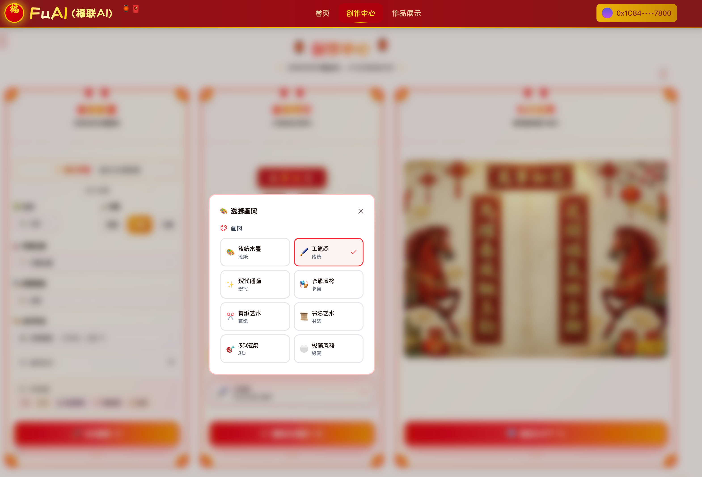


### 作品展示布局

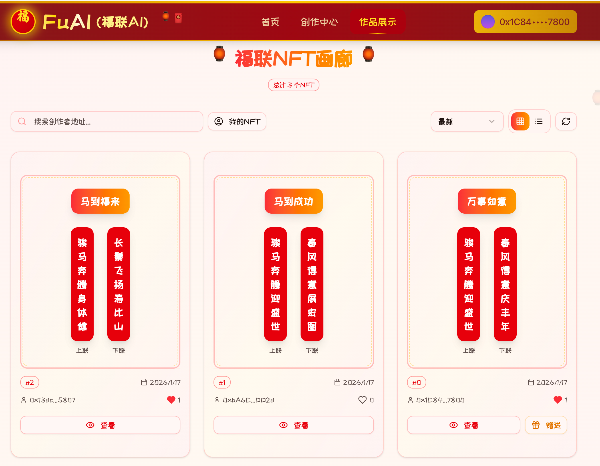

### 查看春联NFT详情

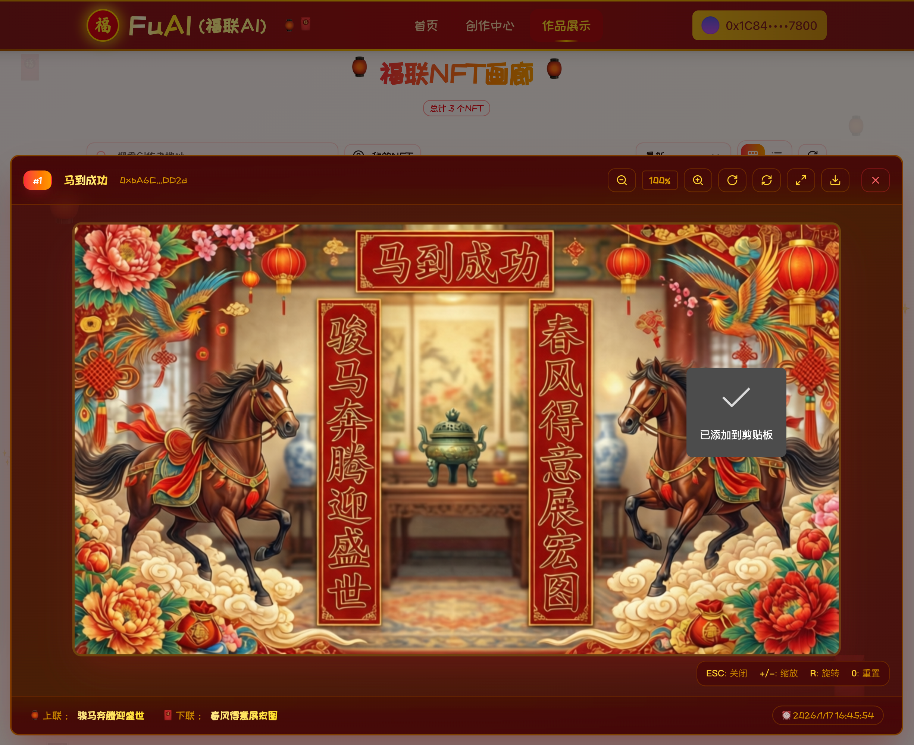

### 赠送春联NFT

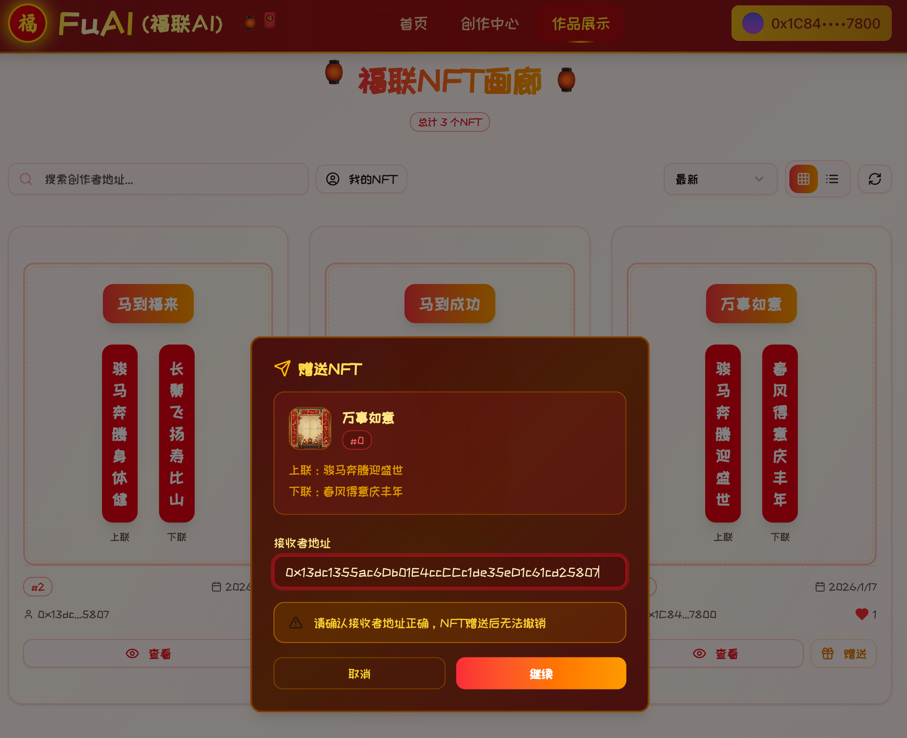

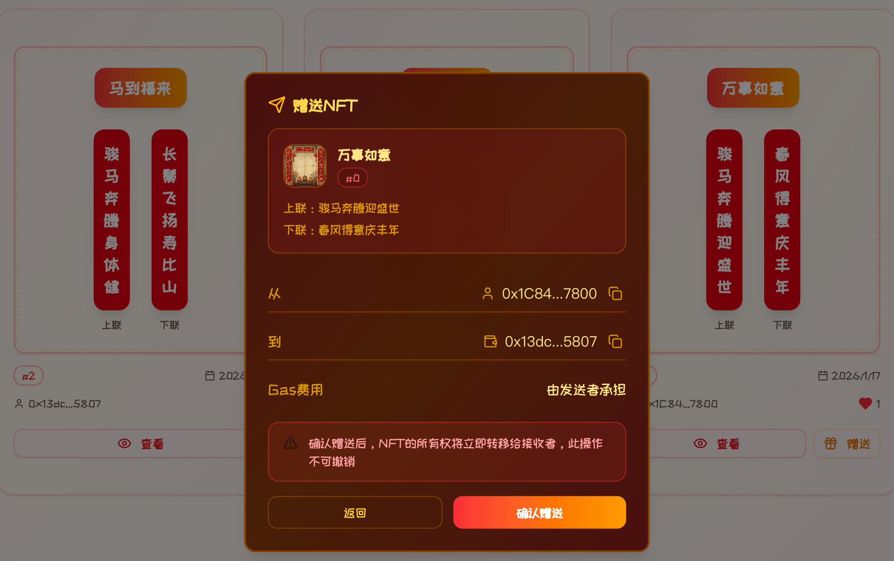

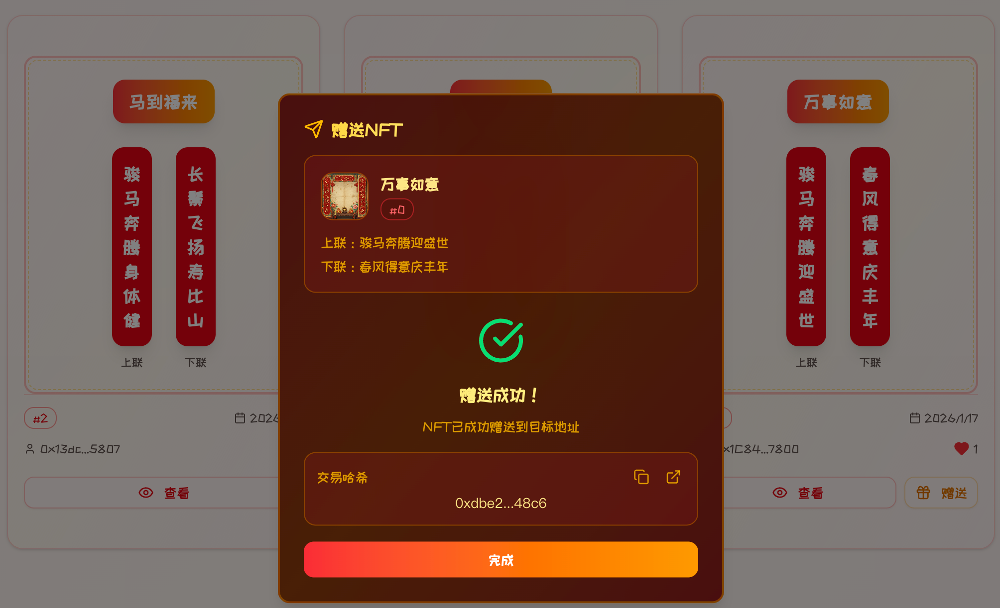

---

## 🏗️ 项目架构

### 系统架构图

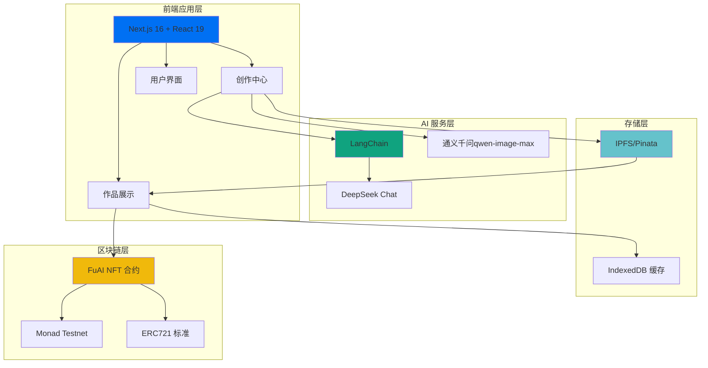

### 技术栈全景

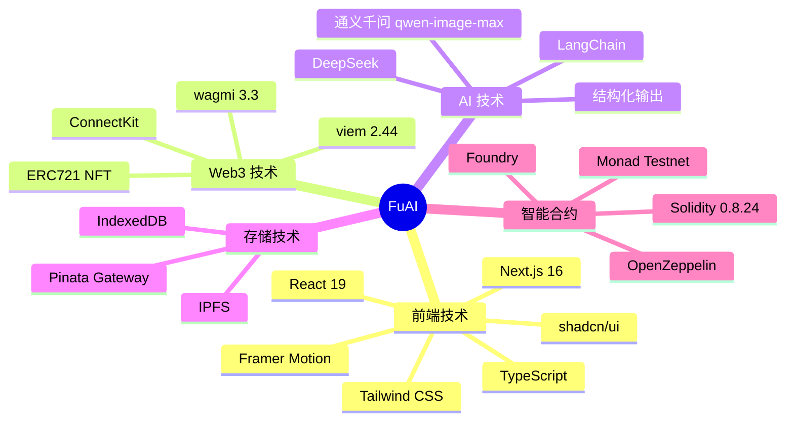

---

## 🎯 功能特性

### 🎨 1. AI 智能创作

<details open>
<summary>点击展开详情</summary>

- ✅ **多维度配置**
  - 12 生肖选择（🐀-🐖）
  - 字数选择（五言/七言/九言）
  - 4 种创作风格（传统典雅、现代简约、幽默搞笑、文艺清新）
  - 8 种祝福主题（万事如意、财源广进、健康长寿等）
  - 4 种预期氛围（庄重、活泼、温馨、霸气）
  
- ✅ **特色功能**
  - 🎭 藏头春联（支持 2-4 字姓名藏头）
  - 🎲 随机灵感（一键生成随机主题）
  - 📝 实时解释（AI 解读春联含义）

**创作流程图：**

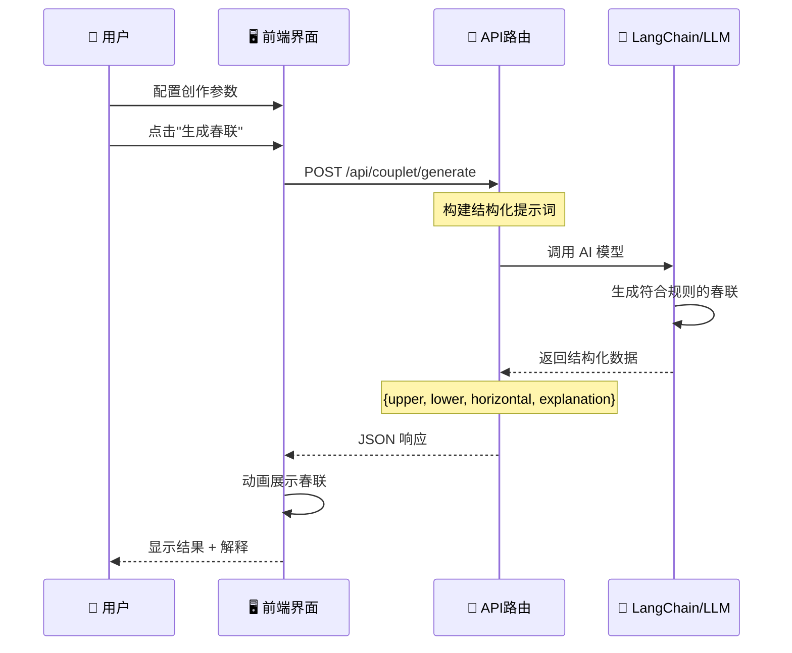

</details>

### 🖼️ 2. 多风格图片生成

<details open>
<summary>点击展开详情</summary>

支持 **5 × 3 × 3 = 45** 种组合样式：

| 画风类型 | 色调方案 | 布局类型 |
|---------|---------|---------|
| 🎨 传统工笔 | 🔴 经典红金 | 📱 竖版 |
| 🖌️ 水墨写意 | 🟠 温暖橙黄 | 🖥️ 横版 |
| ✨ 现代简约 | 🔵 高雅蓝金 | ⬜ 方形 |
| 🎪 卡通可爱 | | |
| 🎬 3D 写实 | | |

**图片生成流程：**

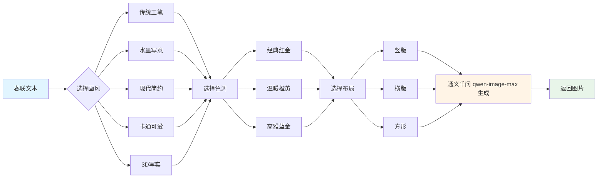

</details>

### 💎 3. NFT 铸造与管理

<details open>
<summary>点击展开详情</summary>

**NFT 铸造流程：**

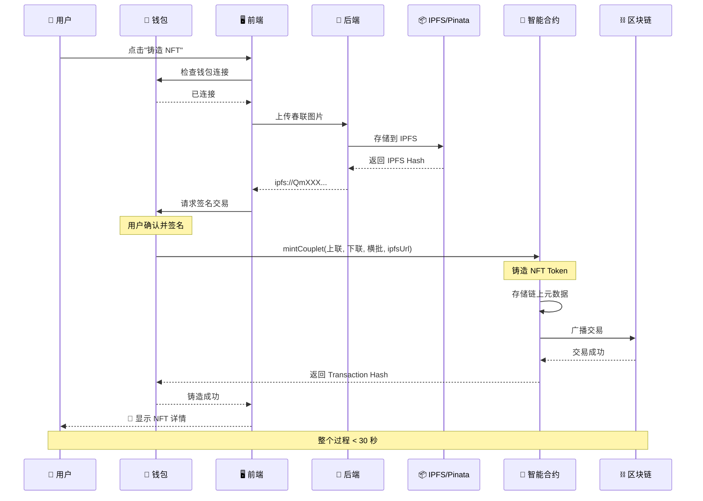

**合约数据结构：**

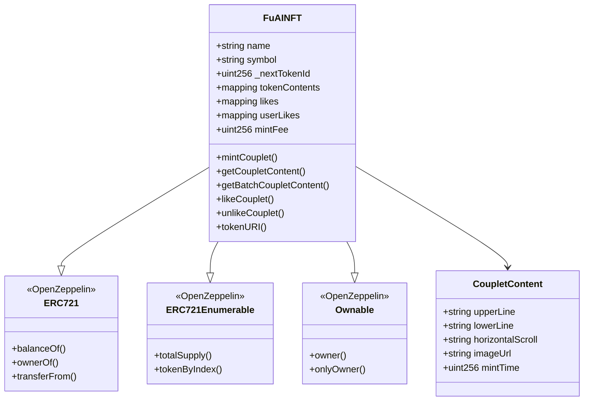

</details>

### 🖼️ 4. 作品展示与社交

<details open>
<summary>点击展开详情</summary>

- ✅ **分页浏览**：每页 20 个 NFT，支持无限滚动
- ✅ **智能排序**：最新/最早/最受欢迎
- ✅ **高级过滤**：按创作者地址、只看我的 NFT
- ✅ **视图切换**：网格视图/列表视图
- ✅ **搜索功能**：快速查找特定地址的作品
- ✅ **社交互动**：点赞、转移 NFT
- ✅ **图片查看器**：放大查看高清春联图片

**数据查询优化：**

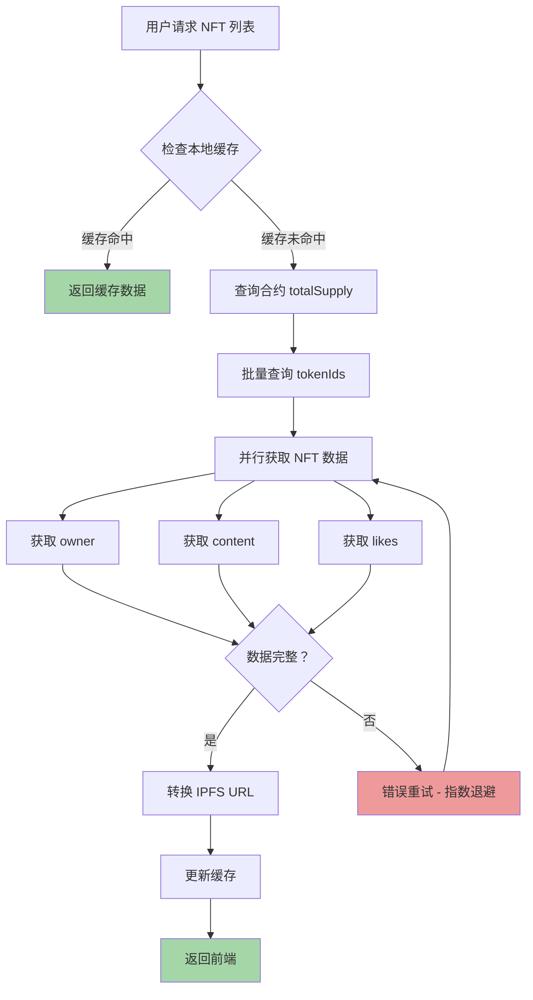

</details>

---

## 🚀 快速开始

### 前置要求

```bash
# 需要安装以下工具
Node.js >= 18.0.0
npm >= 9.0.0
Foundry (智能合约开发)
MetaMask 或其他 Web3 钱包
```

**⚠️ 重要提示：本项目部署在 Monad 测试网**

- 🌐 **网络**：Monad Testnet
- 💧 **领取测试币**：[https://faucet.monad.xyz/](https://faucet.monad.xyz/)
- 📝 **说明**：使用前请先添加 Monad 测试网到钱包，并领取测试币用于支付 Gas 费用

### 1. 克隆项目

```bash
git clone https://github.com/your-username/FuAI.git
cd FuAI
```

### 2. 部署智能合约

```bash
cd contract/couplet-fu-ai

# 安装 Foundry 依赖
forge install

# 编译合约
forge build

# 运行测试
forge test -vv

# 部署到 Monad Testnet
# 注意：请确保钱包中有足够的 Monad 测试币
./deploy.sh
```

> 💡 **提示**：部署前请确保已在 [Monad 水龙头](https://faucet.monad.xyz/) 领取测试币

### 3. 启动前端

```bash
cd ../../frontend

# 安装依赖
npm install

# 配置环境变量
cp .env.example .env
# 编辑 .env 文件，填入 API Keys

# 启动开发服务器
npm run dev
```

访问 `http://localhost:3000` 即可体验！

---

## 📁 项目结构

```
FuAI/
│
├── contract/                       # 智能合约
│   └── couplet-fu-ai/
│       ├── src/
│       │   └── FuAINFT.sol # 主合约（308 行）
│       ├── test/
│       │   └── FuAINFT.t.sol # 测试用例（478 行）
│       ├── script/
│       │   └── Deploy.s.sol       # 部署脚本
│       └── foundry.toml            # Foundry 配置
│
└── frontend/                       # 前端应用
    ├── app/                        # Next.js 页面
    │   ├── page.tsx                # 首页
    │   ├── create/                 # 🎨 创作中心（1353 行）
    │   ├── gallery/                # 🖼️ 作品展示（427 行）
    │   └── api/                    # API 路由
    │       └── couplet/
    │           ├── generate/       # 春联生成 API
    │           └── image/          # 图片生成 API
    │
    ├── components/                 # React 组件
    │   ├── header.tsx              # 顶部导航
    │   ├── nft/                    # NFT 组件
    │   └── ui/                     # 基础 UI（shadcn/ui）
    │
    ├── hooks/                      # 自定义 Hooks
    │   ├── use-couplet-generator.ts # 春联生成
    │   └── use-nft-data.ts         # NFT 数据查询
    │
    ├── mutations/                  # 区块链操作
    │   └── mint_couplet.ts         # NFT 铸造（195 行）
    │
    ├── services/                   # 业务逻辑
    │   ├── nft-service.ts          # NFT 服务（606 行）
    │   └── cache-service.ts        # 缓存服务
    │
    ├── lib/                        # 工具库
    │   └── couplet-generator.ts    # LangChain 生成器
    │
    ├── constants/                  # 常量配置
    │   └── contractConfig.ts       # 合约 ABI（954 行）
    │
    └── types/                      # TypeScript 类型
        ├── nft.ts                  # NFT 类型定义
        └── image-generation.ts     # 图片配置类型
```

---

## 🔧 核心技术实现

### 1. 结构化 AI 输出

使用 Zod Schema 保证 AI 返回数据的可靠性：

```typescript
const CoupletSchema = z.object({
  upper: z.string().describe("上联"),
  lower: z.string().describe("下联"),
  horizontal: z.string().describe("横批"),
  explanation: z.string().describe("解释")
});

// LangChain 结构化输出
const structuredLLM = model.withStructuredOutput(CoupletSchema);
```

### 2. 智能缓存策略

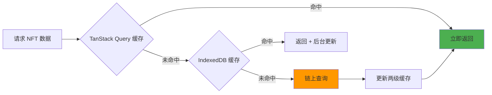

### 3. 批量查询优化

传统方式：N 次 RPC 调用（慢 🐌）
优化方式：1 次批量调用（快 🚀）

```solidity
// 合约支持批量查询
function getBatchCoupletContent(
    uint256[] calldata tokenIds
) external view returns (CoupletContent[] memory) {
    // 一次调用返回所有数据
}
```

### 4. IPFS URL 自动转换

```typescript
// ipfs:// → https:// 网关
const convertIpfsUrl = (ipfsUrl: string) => {
  return ipfsUrl.replace(
    'ipfs://',
    'https://lime-fair-whippet-113.mypinata.cloud/ipfs/'
  );
};
```

---


---

## 📊 数据流图

### 完整的用户旅程


---

## 🔒 安全性保障

### 智能合约安全措施

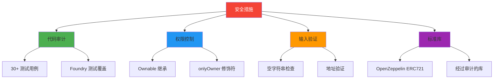

### 前端安全措施

- ✅ 环境变量保护敏感信息
- ✅ 钱包签名验证
- ✅ Zod Schema 输入验证
- ✅ React 自动 XSS 防护
- ✅ HTTPS 强制加密传输

---

## 📈 性能优化

### 加载时间对比

```mermaid
gantt
    title 性能优化前后对比
    dateFormat X
    axisFormat %s
    
    section 优化前
    首次加载        :0, 5s
    NFT 列表查询    :0, 8s
    图片加载        :0, 6s
    
    section 优化后
    首次加载        :0, 2s
    NFT 列表查询    :0, 3s
    图片加载        :0, 1s
```

### 优化措施

| 优化项 | 措施 | 效果 |
|-------|------|------|
| **数据查询** | 批量调用 + 缓存 | 查询速度提升 **60%** |
| **图片加载** | 懒加载 + CDN | 加载时间减少 **80%** |
| **首屏渲染** | SSR + 预加载 | FCP 提升 **70%** |
| **缓存策略** | 两级缓存 | 重复访问 **即时响应** |

---

## 🌟 项目亮点

### 技术创新

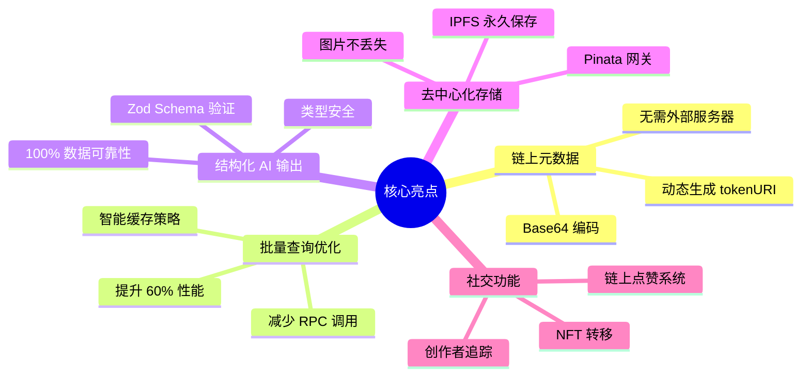

### 用户体验优势

- 🎨 **丰富配置**：45 种图片样式组合
- 🚀 **极速生成**：AI 生成春联 < 5 秒
- 💎 **一键铸造**：30 秒完成 NFT 铸造
- 📱 **响应式设计**：完美适配各种设备
- 🔄 **实时更新**：智能缓存 + 自动刷新

---

## 🚧 技术栈

- [Next.js](https://nextjs.org/) - React 框架
- [LangChain](https://www.langchain.com/) - LLM 应用框架
- [OpenZeppelin](https://www.openzeppelin.com/) - 智能合约库
- [shadcn/ui](https://ui.shadcn.com/) - UI 组件库
- [wagmi](https://wagmi.sh/) - React Hooks for Ethereum
- [Monad](https://monad.xyz/) - 高性能区块链
- [Pinata](https://pinata.cloud/) - IPFS 服务

<div align="center">

**🎊 用 AI 创作春联，让传统文化在区块链上永存 🎊**

Made with ❤️ by FuAI Team

[⬆️ 回到顶部](#-FuAI福联-ai)

</div>
